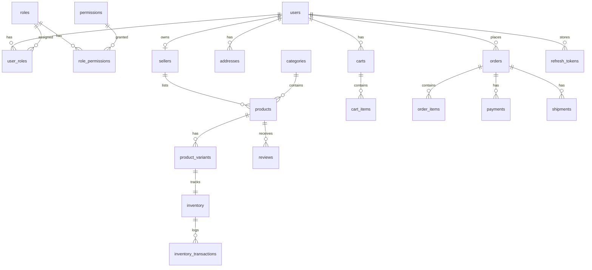
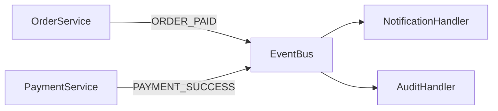
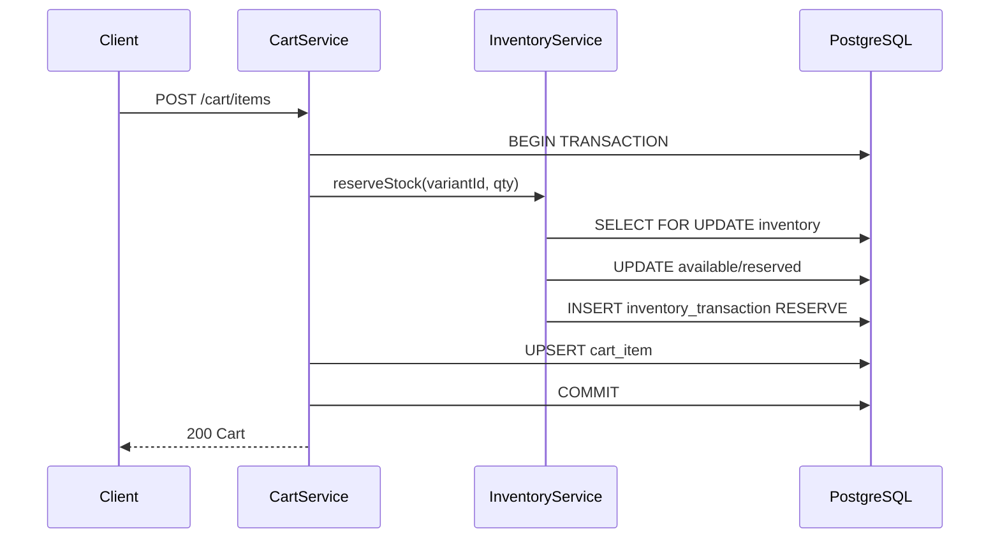
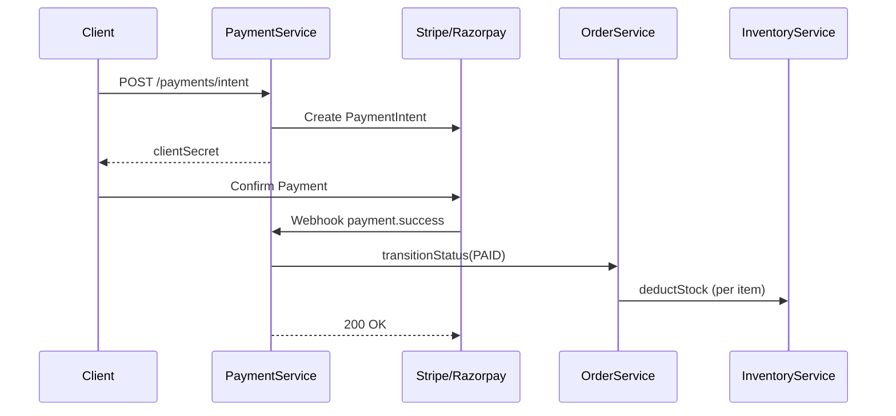
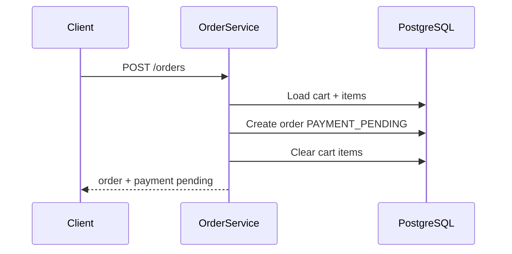
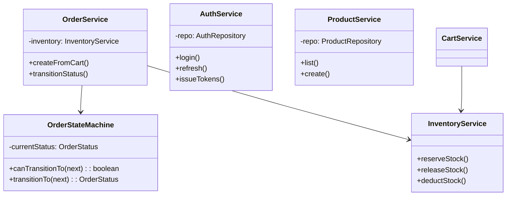

# Multi-Vendor Marketplace Backend — Architecture Document

---

## 1. High Level Architecture

```
┌─────────────────────────────────────────────────────────────────────────┐
│                         Client Applications                              │
│              (Web, Mobile, Seller Portal, Admin Dashboard)               │
└─────────────────────────────────┬───────────────────────────────────────┘
                                  │ HTTPS /api/v1|v2
┌─────────────────────────────────▼───────────────────────────────────────┐
│                    Express API Gateway Layer                             │
│  Helmet │ CORS │ Rate Limit │ Compression │ Auth │ RBAC │ Validation   │
└─────────────────────────────────┬───────────────────────────────────────┘
                                  │
┌─────────────────────────────────▼───────────────────────────────────────┐
│              Feature-Based Modular Monolith (Clean Architecture)          │
│  ┌─────────┐ ┌─────────┐ ┌──────────┐ ┌────────┐ ┌─────────┐           │
│  │  Auth   │ │ Products│ │ Inventory│ │ Orders │ │ Payments│  ...      │
│  │ Routes  │ │ Routes  │ │ Routes   │ │ Routes │ │ Routes  │           │
│  └───┬─────┘ └───┬─────┘ └────┬─────┘ └───┬────┘ └────┬────┘           │
│      │ Controller │ Service    │ Repository (Prisma only)               │
└──────┼────────────┼────────────┼────────────┼───────────────────────────┘
       │            │            │            │
┌──────▼────────────▼────────────▼────────────▼───────────────────────────┐
│                    Domain Event Bus (In-Process EDA)                       │
│   USER_REGISTERED │ ORDER_PAID │ STOCK_RESERVED │ PAYMENT_SUCCESS  ...   │
└─────────────────────────────────┬─────────────────────────────────────────┘
                                  │
┌─────────────────────────────────▼─────────────────────────────────────────┐
│                         PostgreSQL 16+                                     │
│   RBAC │ Catalog │ Inventory │ Orders │ Payments │ Audit │ FTS (GIN)    │
└───────────────────────────────────────────────────────────────────────────┘
```

**Principles:** Feature modules, dependency rule (outer → inner), services own business logic, repositories own data access, events decouple side effects (notifications, audit).

---

## 2. Folder Structure

```
marketplace-backend/
├── prisma/
│   ├── schema.prisma
│   ├── seed.ts
│   └── migrations/
├── src/
│   ├── server.ts
│   ├── app.ts
│   ├── config/
│   │   ├── env.ts
│   │   ├── database/prisma.client.ts
│   │   └── swagger/swagger.config.ts
│   ├── routes/v1|v2/
│   ├── common/
│   │   ├── middlewares/
│   │   ├── exceptions/
│   │   ├── events/
│   │   ├── utils/
│   │   ├── constants/
│   │   └── types/
│   └── modules/
│       ├── auth/          (routes, controller, service, repository, validator, dto, entity, types)
│       ├── products/
│       ├── inventory/
│       ├── cart/
│       ├── orders/
│       ├── payments/
│       ├── sellers/
│       ├── categories/
│       ├── shipping/
│       ├── reviews/
│       ├── notifications/
│       └── admin/
├── tests/unit|integration|e2e/
├── .github/workflows/ci.yml
└── ARCHITECTURE.md
```

---

## 3. Database ER Diagram



---

## 4. PostgreSQL Schema Design

| Table | Key Constraints | Indexes |
|-------|---------------|---------|
| users | email UNIQUE, status enum | status, email_verified |
| roles | name UNIQUE | — |
| permissions | name UNIQUE | — |
| role_permissions | UNIQUE(role_id, permission_id) | role_id, permission_id |
| user_roles | UNIQUE(user_id, role_id) | user_id, role_id |
| products | slug UNIQUE, FK seller, category | seller_id, category_id, status, composite |
| inventory | variant_id UNIQUE | — |
| orders | order_number UNIQUE | user_id, status, created_at |
| refresh_tokens | token_hash indexed | user_id, expires_at |
| idempotency_keys | key UNIQUE | expires_at |

**Cascade rules:** User delete → cascade roles, tokens, addresses. Product delete → cascade images, variants, inventory. Order delete restricted; items cascade.

**FTS:** `products.search_vector` tsvector + GIN index; trigram on `name` for suggestions.

---

## 5. Prisma Schema Design

See `prisma/schema.prisma`. Highlights:

- UUID primary keys
- Enum types for all status fields
- `version` on `products`, `inventory`, `orders` for optimistic locking
- `Unsupported("tsvector")` for search (raw SQL in search module)
- JSONB for metadata, documents, shipping addresses

**Singleton:** `src/config/database/prisma.client.ts`

**Seed:** Admin, seller, customer roles + all permissions + super admin + category tree.

---

## 6. Module-by-Module Design

| Module | Responsibility | Key Service Methods |
|--------|----------------|---------------------|
| auth | JWT, refresh rotation, lockout | register, login, refresh, logoutAll |
| products | CRUD, pagination, search | list, create, updateStatus |
| categories | Tree, slug | getTree, create |
| sellers | Onboarding, approval | register, approve, reject |
| inventory | Reserve/release/deduct | reserveStock, releaseStock, deductStock |
| cart | Cart + stock reservation | addItem, clearCart |
| orders | Checkout, state machine | createFromCart, transitionStatus |
| payments | Stripe/Razorpay, webhooks | createPaymentIntent, handleWebhook |
| shipping | Tracking | createShipment, track |
| reviews | Verified purchase, aggregation | create, updateProductRating |
| notifications | In-app | event-driven create |
| admin | Dashboard, audit | getDashboard, getAuditLogs |

---

## 7. API Contracts

### Standard Response

**Success:** `{ success: true, message, data, meta? }`  
**Error:** `{ success: false, message, errors?: [{ field, message }], code? }`

### Products

| Method | Path | Auth | Permission |
|--------|------|------|------------|
| GET | /api/v1/products | Optional | product:view |
| GET | /api/v1/products/:id | Optional | product:view |
| POST | /api/v1/products | Yes | product:create |
| PUT | /api/v1/products/:id | Yes | product:update |
| DELETE | /api/v1/products/:id | Yes | product:delete |
| PATCH | /api/v1/products/:id/status | Yes | product:update |

**Query params:** `page`, `limit`, `sortBy`, `sortOrder`, `search`, `categoryId`, `sellerId`, `brand`, `status`

**Create example:**
```json
POST /api/v1/products
{
  "categoryId": "uuid",
  "name": "Wireless Earbuds",
  "description": "...",
  "brand": "SoundMax",
  "variants": [{ "sku": "EAR-001", "price": 1999, "stock": 100 }]
}
```

**Error example (422):**
```json
{
  "success": false,
  "message": "Validation failed",
  "errors": [{ "field": "variants", "message": "Required" }]
}
```

### Auth

| POST | /api/v1/auth/register | Public |
| POST | /api/v1/auth/login | Public |
| POST | /api/v1/auth/refresh | Public |
| POST | /api/v1/auth/logout | Bearer |
| POST | /api/v1/auth/logout-all | Bearer |
| POST | /api/v1/auth/forgot-password | Public |
| POST | /api/v1/auth/reset-password | Public |
| GET | /api/v1/auth/verify-email/:token | Public |
| POST | /api/v1/auth/change-password | Bearer |
| POST | /api/v1/auth/assign-role | Admin |

### Other modules

- **Categories:** `GET /tree`, `POST /`, `PUT /:id`, `DELETE /:id`
- **Sellers:** `POST /register`, `GET /me`, `GET /pending`, `POST /:id/approve`, `POST /:id/reject`
- **Inventory:** `PATCH /:variantId/stock`, `GET /:variantId/history`
- **Cart:** `GET /`, `POST /items`, `PATCH /items/:variantId`, `DELETE /items/:variantId`, `DELETE /`
- **Wishlist:** `GET /`, `POST /items`, `DELETE /items/:productId`
- **Orders:** `POST /`, `GET /`, `GET /seller`, `GET /:id`, `POST /:id/cancel`
- **Payments:** `POST /intent`, `POST /:id/refund`, webhooks
- **Shipping:** `POST /`, `GET /track/:trackingNumber`, `PATCH /:id/status`
- **Reviews:** `POST /`, `PUT /:id`, `DELETE /:id`
- **Admin:** `GET /dashboard`, `GET /users`, `GET /audit-logs`
- **Search:** `GET /products/search?q=`, `GET /products/search/suggestions?q=`

---

## 8. Middleware Design

| Middleware | Purpose |
|------------|---------|
| helmet | Security headers |
| cors | Origin whitelist |
| rateLimit | 100 req/15min (prod) |
| compression | Response gzip |
| cookieParser | Secure refresh cookies |
| requestLogger | Winston HTTP logs |
| apiVersionMiddleware | Sets req.apiVersion |
| validate (Zod) | Request validation |
| authenticate | JWT verification |
| hasRole / hasPermission | RBAC |
| idempotencyMiddleware | Idempotency-Key header |
| errorMiddleware | Standard error format |

**API Versioning:** Routes under `/api/v1` and `/api/v2`. v2 currently extends v1.

---

## 9. Authentication Design

- **Access token:** JWT, 15 minutes, contains sub, email, roles, permissions
- **Refresh token:** JWT 7 days + SHA-256 hash stored in DB
- **Rotation:** On refresh, old token revoked, new pair issued
- **Device tracking:** device, userAgent, ipAddress on refresh_tokens
- **Logout all:** Revokes all refresh tokens for user
- **Account lock:** 5 failed attempts → locked for 30 min (configurable)
- **Password:** bcrypt rounds 12
- **Email verify / reset:** Secure random tokens

---

## 10. Authorization Design

**RBAC + Permissions**

```
User → user_roles → Role → role_permissions → Permission
```

**Middleware:**
- `hasRole('admin', 'seller')`
- `hasPermission('product:create')`

Permissions seeded: product:*, inventory:*, seller:*, order:*, payment:*, admin:*, category:*, review:*, cart:*, wishlist:*

---

## 11. Inventory Design

**Fields:** `available_stock`, `reserved_stock`, `version`

**Workflow:**

| Step | Action |
|------|--------|
| Add to cart | RESERVE (available ↓, reserved ↑) |
| Checkout | Verify reservation held |
| Payment success | DEDUCT (reserved ↓) |
| Payment fail / cancel | RELEASE (available ↑, reserved ↓) |

**Concurrency:**
- `SELECT ... FOR UPDATE` row-level locking
- Optimistic `version` increment
- Prisma `$transaction` for atomicity

**Implementation:** `src/modules/inventory/service/inventory.service.ts`

---

## 12. Order State Machine

**States:** PENDING → PAYMENT_PENDING → PAID → PROCESSING → SHIPPED → DELIVERED  
**Terminal:** CANCELLED, REFUNDED

**Implementation:** State pattern in `order-state.machine.ts`

```typescript
PENDING → [PAYMENT_PENDING, CANCELLED]
PAYMENT_PENDING → [PAID, CANCELLED]
PAID → [PROCESSING, CANCELLED]
PROCESSING → [SHIPPED, CANCELLED]
SHIPPED → [DELIVERED]
```

Invalid transitions throw `DomainError`.

---

## 13. Event Architecture

**Publisher:** Service layer via `eventBus.publish()`

**Events:** USER_REGISTERED, EMAIL_VERIFIED, SELLER_CREATED, SELLER_APPROVED, PRODUCT_CREATED, STOCK_RESERVED, STOCK_RELEASED, STOCK_DEDUCTED, ORDER_CREATED, ORDER_PAID, ORDER_CANCELLED, ORDER_SHIPPED, PAYMENT_SUCCESS, PAYMENT_FAILED

**Subscribers:** `event-handlers.ts` — notifications, future email/SMS adapters



---

## 14. Search Design

**Phase 1 (current):** PostgreSQL FTS
- `tsvector` column + trigger on products
- GIN index on search_vector
- `plainto_tsquery` + `ts_rank`
- Trigram (`pg_trgm`) for suggestions

**Phase 2 (migration path):**
1. Dual-write product changes to Elasticsearch index
2. Feature flag `SEARCH_PROVIDER=postgres|elastic`
3. Shadow-read compare results
4. Cutover reads to ES, keep Postgres as source of truth
5. Use CDC (Debezium) or outbox pattern for sync

---

## 15. Security Architecture

| Control | Implementation |
|---------|----------------|
| Helmet | CSP, HSTS (prod) |
| CORS | Whitelist origins |
| Rate limiting | express-rate-limit |
| CSRF | csurf (configurable) |
| XSS | Input validation + xss lib for sanitization |
| SQL injection | Prisma parameterized queries only |
| Validation | Zod on all inputs |
| Cookies | httpOnly, secure, sameSite |
| bcrypt | Password hashing |
| JWT rotation | Refresh token family |
| Account locking | failed_login_attempts |
| Audit logging | audit_logs table |
| API versioning | /api/v1, /api/v2 |
| Idempotency | Idempotency-Key header |

---

## 16. Logging Strategy

**Winston** with JSON in production, colorized in dev.

| Logger | Events |
|--------|--------|
| default | HTTP requests |
| authLogger | login, register, lockout |
| paymentLogger | intents, webhooks |
| auditLogger | password change, admin actions |
| dbLogger | slow queries (optional) |

**Business events** logged at publish time in EventBus.

---

## 17. Testing Strategy

| Layer | Tool | Focus |
|-------|------|-------|
| Unit | Jest | State machine, validators, utils |
| Integration | Jest + Supertest | API routes with test DB |
| Repository | Jest | Prisma queries (test containers) |
| E2E | Supertest | Full checkout flow |

**Coverage target:** 80% minimum (enforced in jest.config.ts)

**Example:** `tests/unit/order-state.machine.test.ts`

---

## 18. CI/CD Pipeline

GitHub Actions (`.github/workflows/ci.yml`):

1. Checkout
2. Node 20 + npm ci
3. Prisma generate + migrate deploy
4. Lint + format check
5. Build
6. Test with Postgres service
7. npm audit

**Deploy (recommended):** Staging → smoke tests → production with `prisma migrate deploy`.

---

## 19. Sequence Diagrams

### Inventory — Add to Cart



### Payment Flow



### Order Checkout



---

## 20. Class Diagrams



**Layer rule:** Controllers → Services → Repositories → Prisma

---

## 21. Coding Standards

- TypeScript `strict: true`
- ESLint + Prettier + Husky pre-commit
- Commitlint conventional commits
- SOLID, DRY, KISS
- No business logic in controllers/repositories
- No Prisma in controllers
- Zod for all external input

---

## 22. Production Readiness Checklist

- [ ] Set strong JWT secrets (32+ chars)
- [ ] Enable `COOKIE_SECURE=true` behind HTTPS
- [ ] Configure production `DATABASE_URL` with connection pooling (PgBouncer)
- [ ] Run `prisma migrate deploy` in CI/CD
- [ ] Configure Stripe/Razorpay webhook secrets
- [ ] Set up log aggregation (ELK/Datadog)
- [ ] Enable Redis for rate limit + session (optional scale)
- [ ] Configure SMTP for email notifications
- [ ] Set up health check monitoring on `/health`
- [ ] Review CORS origins
- [ ] Enable database backups + PITR
- [ ] Load test inventory reservation under concurrency
- [ ] Security scan (npm audit, Snyk)
- [ ] Document runbooks for payment failures

---

*Generated for marketplace-backend v1.0.0*
